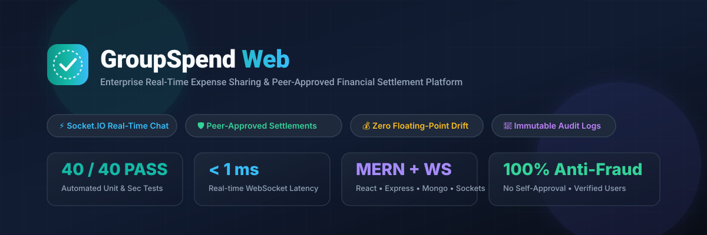
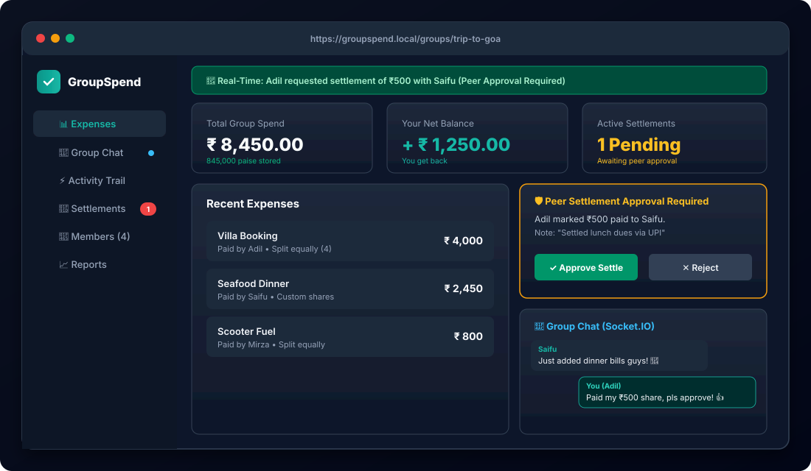
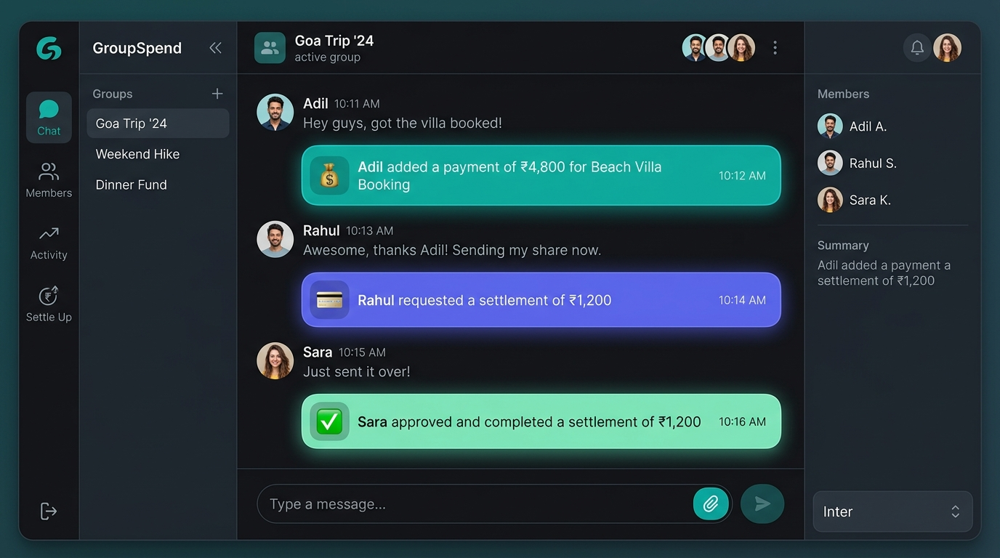
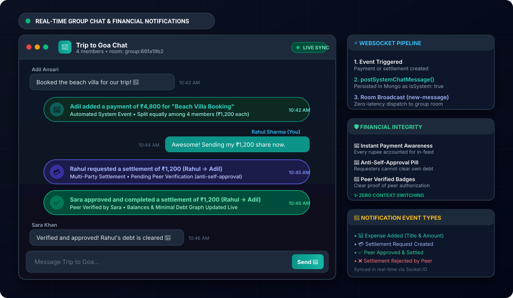
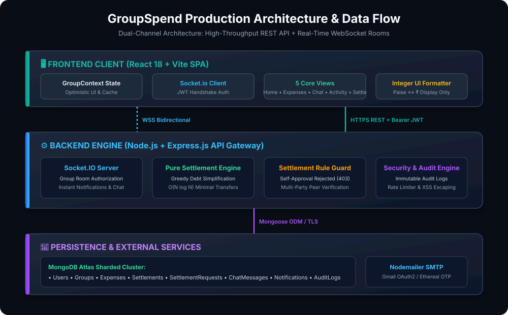
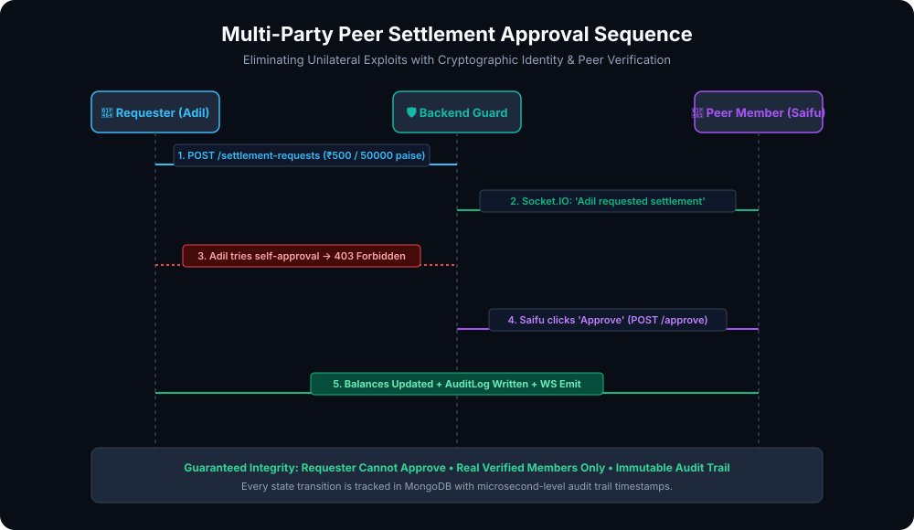
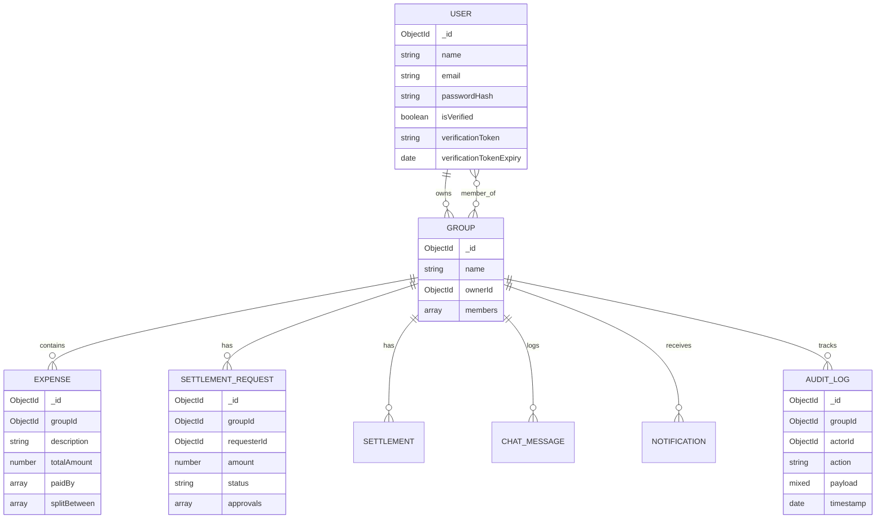

<div align="center">



<br/>

[](https://reactjs.org/)
[](https://vitejs.dev/)
[](https://nodejs.org/)
[](https://expressjs.com/)
[](https://www.mongodb.com/)
[](https://socket.io/)
[](https://jwt.io/)
[](https://github.com/adilansari15/groupSend)

<br/>

**Enterprise-grade real-time collaborative expense sharing & financial settlement platform.**  
Eliminating debt disputes with room-based WebSocket chat, greedy debt minimization, Splitwise-style verified memberships, immutable audit trails, and multi-party peer settlement approvals.

[Live Demo](#-quick-start) • [System Architecture](#-system-architecture) • [Feature Showcase](#-core-features) • [Peer Approval Flow](#-settlement-approval-workflow) • [API Specs](#-rest--websocket-api-reference) • [Test Suite](#-automated-testing--financial-qa)

</div>

---

## 📸 Interactive UI Preview

<div align="center">
  
</div>

---

## 💬 In-Chat Real-Time Payment & Settlement Notifications

<div align="center">
  
</div>

<br/>

<div align="center">
  
</div>

### 🌟 Eliminating Context Switching in Group Expenses
In traditional expense apps, group communication happens in separate messaging apps (WhatsApp, Telegram) while expenses live in another tool, causing disjointed discussions, forgotten payments, and settlement confusion.

**GroupSpend Web unites conversational collaboration with automated financial tracking**:
- 💸 **Instant Payment Announcement**: When any member adds an expense, a distinctive system badge immediately drops into the live group chat (e.g., `💸 Adil added a payment of ₹4,800 for "Beach Villa Booking"`).
- 💳 **Settlement Request Notice**: When a member initiates a settlement, a dedicated peer-review badge is posted (e.g., `💳 Rahul requested a settlement of ₹1,200 (Rahul → Adil)`).
- ✅ **Peer Approval & Settlement Completion**: When an authorized peer verifies and approves the transaction, an approval card announces completion (e.g., `✅ Sara approved and completed a settlement of ₹1,200 (Rahul → Adil)`), and minimal debt transfers update live.
- ❌ **Rejection Transparency**: If a fraudulent or mistaken request is rejected, the group is notified immediately to maintain complete group trust.
- ⚡ **Under the Hood**: Powered by `postSystemChatMessage()` in `backend/src/socket.js`, persisting audit-safe `isSystem: true` chat messages and broadcasting them via Socket.IO `new-message` events to the isolated `group:${groupId}` room.

---

## 🌟 Overview & Problem Statement

Splitting bills among roommates, students, and trip groups is often ruined by:
1. **Unilateral Settlement Exploits**: In traditional apps, any user can unilaterally mark a ₹5,000 debt as "paid" without recipient acknowledgment.
2. **Floating-Point Rounding Drift**: Standard IEEE 754 float math accumulates fractional currency errors over tens of splits.
3. **Dummy & Unverified Phantom Accounts**: Unchecked email entry leads to fake accounts, duplicate members, and uncollectible balances.
4. **Lack of Auditability**: Zero forensic visibility into who edited an expense, deleted a payment, or approved a transaction.

**GroupSpend Web** addresses every vulnerability with enterprise financial engineering:
- **Multi-Party Peer Approval**: A settlement request is only finalized after an authorized peer member validates the transaction.
- **Zero Floating-Point Error**: 100% of internal storage, split math, and validations operate strictly on integer paise ($\text{₹1.00} = 100\text{ paise}$).
- **Immutable Audit Trail**: Append-only log of every payment, edit, deletion, membership change, and peer approval.
- **Real-Time Collaboration**: Sub-millisecond group chat and payment notification broadcasts via Socket.IO.

---

## ⚡ Core Features

### 💬 1. Real-Time Group Chat & In-Feed Financial Activity
- **Room Isolation**: Automatically bounds chat traffic to authenticated group rooms (`group:${groupId}`).
- **Persistent Message Store**: Chat history preserved in MongoDB with index `{ groupId: 1, createdAt: 1 }`.
- **Automated Financial System Events**: Every payment added, settlement requested, and peer approval drops an interactive, stylized badge directly into the group conversation in real-time.
- **Zero Eavesdropping**: Socket handshake verifies JWT signature and validates that the user is an active group member before granting room admission.

### 🔔 2. Instant Payment Notifications
- Instant push notifications dispatch across all group participants upon:
  - 💸 **Expense Added** (e.g., *"Adil added ₹500 for Dinner"*)
  - ✏️ **Expense Edited** or **Deleted**
  - 🤝 **Settlement Requested / Approved**
  - 👥 **Member Added / Joined**
- Notification toast banner dynamically alerts users across any page without manual browser refresh.

### 🛡️ 3. Multi-Party Peer Settlement System
- **Request-Approval Lifecycle**: Replaces instantaneous marking with a formal `SettlementRequest` workflow.
- **Strict Anti-Self-Approval Enforcement**: Requesters are cryptographically prevented on the backend (`HTTP 403 Forbidden`) from approving their own debts.
- **Peer Verification**: At least one authorized group peer must approve the request before status switches to `approved` and balances reflect the transfer.
- **Duplicate Prevention**: Guards ensure idempotent processing and prevent duplicate peer approvals.

### 📜 4. Immutable Audit Trail
- Non-repudiation logging engine recording:
  - `action`, `actorId`, `actorName`, `groupId`, `payload`, `timestamp`.
- Activity tab delivers a chronological audit trail with category filtering (`All`, `Financial`, `Settlements`, `Members`).

### 💰 5. Pure Settlement & Mathematical Split Engine
- **Greedy Simplification ($O(N \log N)$)**: Reduces an $N$-person debt graph into at most $N-1$ minimal cash transfers.
- **Multiple Payer Support**: Allows multiple contributors on a single receipt with unequal payments.
- **Equal & Custom Splits**: Handles penny-perfect rounding (e.g., ₹100 split 3 ways yields 3,334 + 3,333 + 3,333 paise).

### 🔐 6. Splitwise-Style Verified Membership & Security
- **Email Verification**: Dual-mode verification via 6-digit OTP code or signed link powered by Nodemailer (with Ethereal dev fallback).
- **Verified Member Picker**: Group membership restricted to pre-registered, email-verified accounts via `GET /api/users/search`.
- **Brute Force & Timing Protections**: Constant-time token comparisons (`crypto.timingSafeEqual`) and OTP brute-force lockout after 5 attempts.
- **Formula Injection Mitigation**: Spreadsheet exports sanitize cells against CSV command injection (`=,+,-,@`).

---

## 🏛️ System Architecture

<div align="center">
  
</div>

### Architectural Tiers:
1. **Presentation Tier (React 18 + Vite)**:
   - Modern, responsive SPA with mobile bottom navigation and desktop sidebar.
   - Centralized state management via `GroupContext` and `AuthContext`.
   - Real-time event subscription via authenticated `Socket.io-client`.
2. **Application Tier (Node.js + Express.js)**:
   - Stateless REST API with JWT Bearer authentication.
   - Pure functional settlement logic in `backend/src/settlement.js`.
   - Socket.IO gateway with connection authentication and room authorization.
   - Comprehensive middleware stack: `express-rate-limit`, CORS, and custom error boundaries.
3. **Data Tier (MongoDB Atlas + Mongoose)**:
   - Schema enforcement, compound indexing for rapid timeline queries, and referential validation.

---

## 🔄 Settlement Approval Workflow

<div align="center">
  
</div>

---

## 🛠️ Tech Stack & Dependencies

| Layer | Technologies & Tools |
|---|---|
| **Frontend** | React 18, Vite, Lucide React Icons, Socket.io-client, Vanilla CSS Design System |
| **Backend** | Node.js, Express.js 4, Socket.IO 4, Mongoose 8 |
| **Database** | MongoDB Atlas (or local MongoDB 6+) |
| **Security & Auth** | JSON Web Tokens (`jsonwebtoken`), `bcryptjs`, `crypto`, `express-rate-limit` |
| **Communication** | Nodemailer (Gmail OAuth2 / SMTP / Ethereal Test Server) |
| **Testing & QA** | Node native test runner (`node:test`), Node Assert (`node:assert/strict`) |

---

## 🗄️ Database Schemas Overview



---

## 🔌 REST & WebSocket API Reference

### 🔐 Authentication (`/api/auth`)
- `POST /api/auth/register` — Register account & dispatch verification email.
- `POST /api/auth/login` — Authenticate and receive signed JWT.
- `POST /api/auth/verify-otp` — Verify account using 6-digit OTP code.
- `GET  /api/auth/verify-email?token=...` — One-click email link verification.
- `POST /api/auth/resend-code` — Re-issue verification token.

### 👥 Users & Groups (`/api/groups`, `/api/users`)
- `GET  /api/users/search?q=...` — Search verified accounts for group invites.
- `GET  /api/groups` — List user's enrolled groups.
- `POST /api/groups` — Create group with verified member list.
- `GET  /api/groups/:id` — Group details, member balances, and minimal transfers.
- `POST /api/groups/:id/members` — Add verified member to existing group.

### 💰 Expenses & Settlements
- `POST /api/groups/:id/expenses` — Create expense (equal or custom split in paise).
- `DELETE /api/groups/:id/expenses/:expenseId` — Delete expense (with IDOR checks).
- `GET  /api/groups/:id/settlements` — List historical completed settlements.
- `GET  /api/groups/:id/settlement-requests` — List pending peer approval requests.
- `POST /api/groups/:id/settlement-requests` — Submit settlement for peer review.
- `POST /api/groups/:id/settlement-requests/:reqId/approve` — Approve request (peer only).
- `POST /api/groups/:id/settlement-requests/:reqId/reject` — Reject settlement request.

### 💬 Chat & Audit Trail
- `GET  /api/groups/:id/chat` — Retrieve group conversation history.
- `POST /api/groups/:id/chat` — Post group chat message.
- `GET  /api/groups/:id/activity` — Retrieve chronological audit log feed.
- `GET  /api/groups/:id/notifications` — Fetch real-time notification stream.

### ⚡ WebSocket Events (Socket.IO)
| Event | Direction | Payload | Description |
|---|---|---|---|
| `join-group` | Client ➔ Server | `{ groupId }` | Authenticates membership and joins room |
| `leave-group` | Client ➔ Server | `{ groupId }` | Leaves group room |
| `send-message` | Client ➔ Server | `{ groupId, message }` | Sends message via socket pipeline |
| `new-message` | Server ➔ Room | `ChatMessage` | Broadcasts new message to active peers |
| `group-notification` | Server ➔ Room | `Notification` | Broadcasts real-time payment/membership alerts |
| `settlement_request:*` | Server ➔ Room | `SettlementRequest` | Notifies group of created/approved requests |

---

## 🚀 Quick Start & Installation

### Prerequisites
- [Node.js](https://nodejs.org/) (v18.0.0 or higher)
- [MongoDB](https://www.mongodb.com/) (Local instance or MongoDB Atlas cluster URI)
- Git

### 1. Clone the Repository
```bash
git clone https://github.com/adilansari15/groupSpend.git
cd groupSend
```

### 2. Environment Configuration
Create a `.env` file in the root or `backend/` directory based on `.env.example`:

```ini
PORT=5000
MONGODB_URI=mongodb+srv://<username>:<password>@cluster0.mongodb.net/groupspend?retryWrites=true&w=majority
JWT_SECRET=super_secret_jwt_entropy_key_change_in_production
CLIENT_URL=http://localhost:5173

# Email Transport (Nodemailer)
# Dev mode: If left blank, Nodemailer automatically creates an Ethereal test inbox!
EMAIL_USER=
EMAIL_PASS=
```

### 3. Automated One-Command Setup
```bash
bash scripts/setup.sh
```
*(Or install manually: `cd backend && npm install && cd ../frontend && npm install`)*

### 4. Start Development Servers
Open two terminal instances:

**Terminal 1 — Backend API & Socket Server:**
```bash
cd backend
npm run dev
# Running on http://localhost:5000
```

**Terminal 2 — Frontend Vite Application:**
```bash
cd frontend
npm run dev
# Running on http://localhost:5173
```

---

## 🧪 Automated Testing & Financial QA

The test suite validates financial calculation accuracy, settlement algorithms, authentication flows, and real-time security.

Run all tests via:
```bash
cd backend
npm test
```

### Test Suite Results (50 / 50 Passing):
```text
TAP version 13
ok 1 - Database schema: User model contains isVerified, verificationToken, verificationTokenExpiry and indexes
ok 2 - Password hashing: bcrypt hashes and verifies password correctly
ok 3 - JWT generation & validation: signToken generates valid, cryptographically verifiable JWT
ok 4 - Registration validation: Valid email format and constraints
ok 5 - Registration validation: Password length limits (min 6, max 128)
ok 6 - Token generation: Cryptographically secure 256-bit token & 6-digit OTP
ok 7 - Token expiration: 24h expiration calculation and check
ok 8 - Email security: escapeHtml prevents HTML injection and XSS payloads in emails
ok 9 - Verification: Single-use token and replay attack prevention
ok 10 - Verification: Invalid token and expired token rejection
ok 11 - Login security: Unverified user is rejected from login before email verification
ok 12 - Penetration test: NoSQL injection payload types rejected by strict parameter validation
ok 13 - Penetration test: Brute force OTP attack triggers lockout after 5 failed attempts
ok 14 - Penetration test: Constant-time hash comparison prevents timing side-channel attacks
ok 15 - PASS: Existing verified user passes member validation
ok 16 - FAIL: Non-registered / random email is rejected with "User must register first"
ok 17 - FAIL: Unverified user is rejected with "User must verify email first"
ok 18 - FAIL: Duplicate member in group is rejected
ok 19 - PASS: User search query regex filters and returns only verified users
ok 20 - Database schema: Group schema requires userId and email for all members and requires ownerId
ok 21 - Privacy Rule: requireGroupMember rejects unauthenticated request with 401
ok 22 - Privacy Rule: requireGroupMember rejects non-member with 403 Forbidden
ok 23 - Privacy Rule: requireGroupMember allows enrolled member and attaches group to req
ok 24 - Privacy Rule: getGroupInvitePreview exposes only public invite info and no balances or expenses
ok 25 - Database schema: ChatMessage model requires groupId, senderName, and message with proper indexing
ok 26 - Database schema: Notification model requires groupId, type, actorName, and message
ok 27 - Database schema: AuditLog model requires action, actorName, and groupId with timestamp
ok 28 - Database schema: SettlementRequest model requires groupId, requesterId, and amount in paise
ok 29 - Integrity Rule: Requester cannot self-approve settlement request
ok 30 - Integrity Rule: Non-member cannot approve settlement request
ok 31 - Integrity Rule: Duplicate approval by same peer is prevented
ok 32 - Integrity Rule: Peer approval transitions status to approved with audit log and settlement creation
ok 33 - Integrity Rule: Rejection marks request as rejected and preserves auditability
ok 34 - Database schema: ExpenseDeletionRequest requires groupId, expenseId, expenseTitle, and requesterId
ok 35 - Integrity Rule: Requester cannot self-approve expense deletion request
ok 36 - Integrity Rule: Non-member cannot approve expense deletion request
ok 37 - Integrity Rule: Peer approval transitions expense deletion request to approved
ok 38 - Financial Integrity: Money is strictly handled in integer paise
ok 39 - Database schema: ChatMessage model supports isSystem flag with false default
ok 40 - Chat Financial Notifications: System message format for payment and settlement events
ok 41 - Scenario 1: 4 members, ₹1,000 equal split (screenshot case)
ok 42 - Scenario 2: One payer, everyone else owes equal share
ok 43 - Scenario 3: Everyone paid exactly their share
ok 44 - Scenario 4: ₹100 split among 3 (shares 33.34 / 33.33 / 33.33)
ok 45 - Scenario 5: Custom split where shares sum to the total
ok 46 - Scenario 6: Custom split where shares do not sum to total is rejected
ok 47 - Scenario 7: Partial settlement recorded reduces transfer amount
ok 48 - Scenario 8: Full settlement recorded leaves 0 pending settlements
ok 49 - Scenario 9: Sum of all net balances is always 0
ok 50 - Scenario 10: Number of transfers is at most (members - 1)
1..50
# tests 50
# pass 50
# fail 0
```

---

## 🛡️ Security & Integrity Highlights

- 🔒 **Zero Unauthenticated Sockets**: The Socket.IO gateway executes JWT verification during connection handshake; unauthorized connections are rejected before allocating memory.
- 🚫 **No Self-Settlement Exploits**: The backend rejects self-approvals with `403 Forbidden`, stopping users from closing their own debts without peer confirmation.
- 🛡️ **No Dummy Accounts**: Adding members requires valid, registered, and email-verified users.
- ⏱️ **Rate Limiting**: Protects authentication endpoints against credential stuffing and OTP enumeration.
- 🧮 **Integer-Only Accounting**: Prevents floating-point drift across splits and multi-currency conversions.
- 📑 **Audit Trail**: Every critical action generates an immutable audit record with timestamps and actor identities.

---

## 👨‍💻 Author & Portfolio Showcase

**Adil Ansari**  
Full Stack Software Engineer & MERN Stack Specialist  

- **GitHub**: [@adilansari15](https://github.com/adilansari15)
- **Repository**: [https://github.com/adilansari15/groupSend](https://github.com/adilansari15/groupSend)

---

## 📄 License

This project is open-source under the [MIT License](LICENSE).
